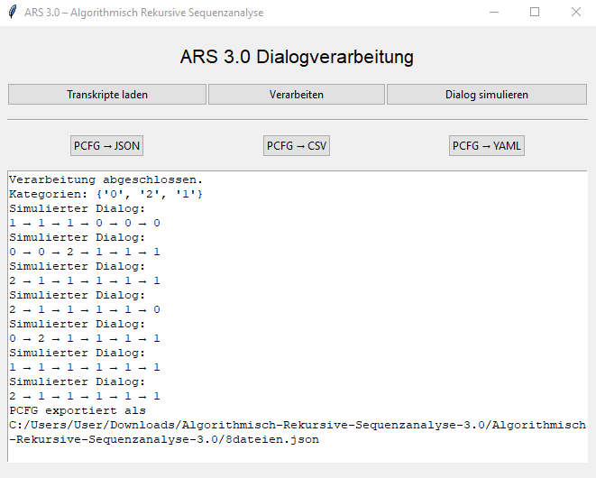

# Algorithmic Recursive Sequence Analysis 3.0


This project provides a web-based application for the automatic analysis of dialog transcripts using Sentence-BERT, HDBSCAN clustering, and probabilistic context-free grammars (PCFG).

## Features

* 📂 Upload multiple transcripts
* 🧠 Sentence-BERT for embeddings
* 📊 HDBSCAN for clustering
* 🧾 Categorization via GPT or local methods
* 📈 Visualization via UMAP
* 🔁 PCFG induction from sequences
* 🎲 Dialog simulation
* 📎 Export PCFG as `.yaml`, `.json`, `.csv`, or `.dot`

## Files

* `app.py` – Main file containing the Streamlit (or tkinter) GUI
* `requirements.txt` – Python dependencies
* `README.md` – This documentation

## Usage

1. Open the web app in your browser
2. Upload `.txt` transcripts
3. The app clusters utterances and generates semantic categories
4. You can export the resulting PCFG or simulate new dialogues

---

# Algorithmic Recursive Sequence Analysis 3.0 (ARS 3.0)

**Algorithmic Recursive Sequence Analysis (ARS 3.0)** is a modular system for the processing, analysis, and simulation of dialogical transcripts. It enables automatic clustering of semantically similar utterances, the generation of probabilistic context-free grammars (PCFG), and the creation of synthetic dialogues based on these structures.

---

## 🔧 Project Structure

```
ars3/
├── ars_core.py            # Core logic: processing, PCFG export, simulation
├── app.py                 # GUI (Streamlit or tkinter)
├── categories.json        # Persistent storage of recognized categories
├── data/
│   └── test_transcript.txt # Example transcript data for analysis
├── output/
│   ├── pcfg.json          # PCFG exported in JSON format
│   ├── pcfg.csv           # PCFG exported in CSV format
│   ├── pcfg.yaml          # PCFG exported in YAML format
│   └── cluster_plot.png   # Visualization of cluster structure
├── requirements.txt       # Dependencies
├── setup.py               # Installation script
└── README.md              # This file
```

---

## 🧠 Core Functions

### `ars_core.py`

* **`process_multiple_dialogs(transcript_paths)`**
  Loads and processes multiple transcripts, clusters semantically similar statements with HDBSCAN, and builds a PCFG.

* **`simulate_dialog(pcfg, max_turns=10)`**
  Simulates a new dialog based on a given PCFG.

* **`export_pcfg_to_json(pcfg, filepath)`**
  Exports the PCFG to a JSON file.

* **`export_pcfg_to_csv(pcfg, filepath)`**
  Exports the PCFG to a CSV file for tabular analysis.

* **`export_pcfg_to_yaml(pcfg, filepath)`**
  Exports the PCFG in YAML format for further processing or editing.

---

## 🖥️ GUI (`app.py`)

* Select transcripts for processing
* Start analysis and clustering
* Visualize the cluster structure
* Export PCFG in various formats
* Simulate new dialogues at the press of a button

The GUI is modular and can be run via Streamlit (web) or tkinter (local desktop interface).

---

## 📦 Installation

1. Clone or unzip the repository

2. Install the required dependencies:

```bash
pip install -r requirements.txt
```

3. Start the GUI (if `app.py` contains a `main()` function):

```bash
python app.py
```

Or via a command-line shortcut (if installed as CLI):

```bash
ars-gui
```

---

## 📈 Export Formats

* **JSON** – Structured, machine-readable format
* **CSV** – For easy tabular analysis (e.g., in Excel or Pandas)
* **YAML** – For readable configuration and external tool integration
* **DOT** – For graph-based visualization via Graphviz or other tools


---


# Algorithmisch-Rekursive Sequenzanalyse 3.0

Dieses Projekt bietet eine Webanwendung zur automatischen Analyse von dialogischen Transkripten mithilfe von Sentence-BERT, HDBSCAN-Clustering und probabilistischen kontextfreien Grammatiken (PCFG).

## Funktionen

- 📂 Mehrfacher Transkript-Upload
- 🧠 Sentence-BERT für Embedding
- 📊 HDBSCAN für Clusterbildung
- 🧾 Kategorien mit GPT oder lokal
- 📈 Visualisierung via UMAP
- 🔁 PCFG-Induktion aus Sequenzen
- 🎲 Simulation von Dialogen
- 📎 Export der PCFG als `.yaml` oder `.dot`

## Dateien

- `app.py` – Die Hauptdatei mit der Streamlit-App
- `requirements.txt` – Python-Abhängigkeiten
- `README.md` – Dieses Dokument


## Nutzung

1. Öffne die Web-App im Browser
2. Lade `.txt`-Transkripte hoch
3. Die App clustert Äußerungen und generiert Kategorien
4. Du kannst die resultierende PCFG exportieren oder Dialoge simulieren


# Algorithmisch Rekursive Sequenzanalyse 3.0


**Algorithmisch Rekursive Sequenzanalyse (ARS 3.0)** ist ein modulares System zur Verarbeitung, Analyse und Simulation von dialogischen Transkripten. Es ermöglicht die automatische Clusterung semantisch ähnlicher Aussagen, den Aufbau probabilistischer kontextfreier Grammatiken (PCFG), sowie die Generierung synthetischer Dialoge auf Basis dieser Strukturen.

---

## 🔧 Projektstruktur


ars3/<br>
├── ars\_core.py            # Zentrale Logik: Verarbeitung, PCFG-Export, Simulation<br>
├── app.py                 # GUI (Streamlit oder tkinter)<br>
├── categories.json        # Persistente Speicherung erkannter Kategorien<br>
├── data/<br>
│   └── test\_transcript.txt # Beispielhafte Dialogdaten zur Analyse<br>
├── output/<br>
│   ├── pcfg.json          # Exportierte PCFG im JSON-Format<br>
│   ├── pcfg.csv           # Exportierte PCFG im CSV-Format<br>
│   ├── pcfg.yaml          # Exportierte PCFG im YAML-Format<br>
│   └── cluster\_plot.png   # Visualisierung der Clusterstruktur<br>
├── requirements.txt       # Abhängigkeiten<br>
├── setup.py               # Installationsskript<br>
└── README.md              # Diese Datei<br>

```

---

## 🧠 Hauptfunktionen

### `ars_core.py`

- **`process_multiple_dialogs(transcript_paths)`**  
  Lädt mehrere Transkripte, analysiert semantisch ähnliche Aussagen, clustert mit HDBSCAN und erstellt eine PCFG.

- **`simulate_dialog(pcfg, max_turns=10)`**  
  Simuliert einen plausiblen neuen Dialog basierend auf einer gegebenen PCFG.

- **`export_pcfg_to_json(pcfg, filepath)`**  
  Exportiert die PCFG in eine JSON-Datei.

- **`export_pcfg_to_csv(pcfg, filepath)`**  
  Exportiert die PCFG in eine CSV-Datei zur besseren tabellarischen Auswertung.

- **`export_pcfg_to_yaml(pcfg, filepath)`**  
  Exportiert die PCFG in das YAML-Format (z. B. für andere Tools oder manuelle Bearbeitung).

---

## 🖥️ GUI (`app.py`)

- Wähle Transkripte zur Verarbeitung
- Starte Analyse & Clustering
- Visualisiere Clusterstruktur
- Exportiere PCFG in verschiedenen Formaten
- Simuliere neue Dialoge auf Knopfdruck

Die GUI ist modular aufgebaut und kann wahlweise in Streamlit (Web) oder tkinter (lokal) betrieben werden.


## 📦 Installation

1. Klone oder entpacke das Repository:

2. Installiere alle Abhängigkeiten:

```bash
pip install -r requirements.txt
```

3. Starte die GUI (wenn `app.py` eine `main()`-Funktion enthält):

```bash
python app.py
```

Oder über den Konsolenbefehl:

```bash
ars-gui
```


---

## 📈 Exportformate

* **JSON**: Für strukturierten maschinenlesbaren Export
* **CSV**: Zur einfachen tabellarischen Analyse (z. B. in Excel oder Pandas)
* **YAML**: Für lesbare Konfigurationen und Weiterverarbeitung in externen Tools


